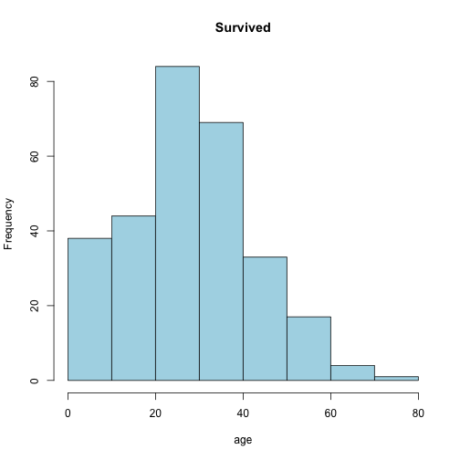

### Welcome to Titanic Passenger Manifest

## Introductions

This application is based on a dataset referencing each passenger and their chances of survival.  

The dataset was obtained via [KDNuggets](http://www.kdnuggets.com/datasets/index.html) at the Github location [GitHub](https://github.com/caesar0301/awesome-public-datasets/blob/master/Datasets/titanic.csv.zip).

The github of the code is here: [Github](https://github.com/motticus/DevelopingDataProducts).
The presentation is here: [Presentation](http://motticus.github.io/DevelopingDataProducts/TitanicStudy.html#/).

I found the dataset interesting although I am unsure of the source and whether it is reliable.  

## Caveats
One caveat is list only has 891 objects while the total number of passengers on the Titanic exceeded 2000.  I have seen the dataset in other areas presumably shared and the list had the same number of objects in that set.  

## Reasoning
The application framework I chose is to narrow down and exclude pieces of data you wish to not include.  For example if you want to see all of the statistics of the number of Survivors for 3rd class males the application can provide that for you.  Also, I used a histogram of the rate and the age of survivors and non survivors.  Survivors is within a separate data tab from Non-Survivors.  

## Usage

 

## Reproduce
Here is the command to run and reproduce the Application:

runGitHub("DevelopingDataProducts","motticus")

## Enjoy
