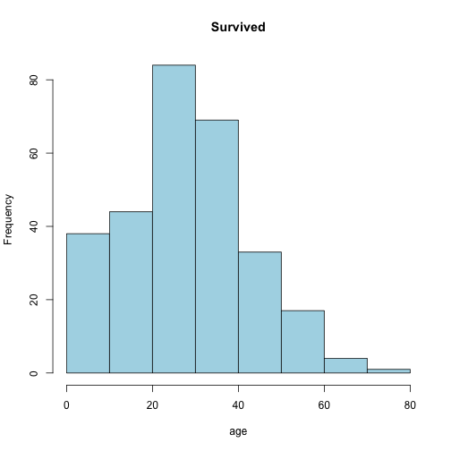

Titanic Study of Survival
========================================================
author: David Mott
date: Sat Jul 25 20:35:24 2015

Introduction
========================================================

What were the chances of survival on the Titanic? 
Does it matter if you were in 1st Class?  Gender?  How much your ticket was? 

Now you can find out.  

- View a semi-complete dataset of people who were on the titanic. 
- Nice histograph graphs, mean data and separate of Survived vs Not survived.  
- Fast interface.  Fully functional. 
- Narrow down data elements to determine survival rate. 

Note:  There were over 2000 passengers on the Titanic.  Data set only has 891 referenced.  

Nice Plots and proper statistics
========================================================

 

More information?
========================================================

Github presentation: 
http://bit.ly/1DFQd3J

Github code:
http://bit.ly/1IoUYnJ

Dataset location:
http://bit.ly/1D5FH41

